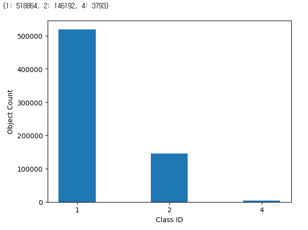
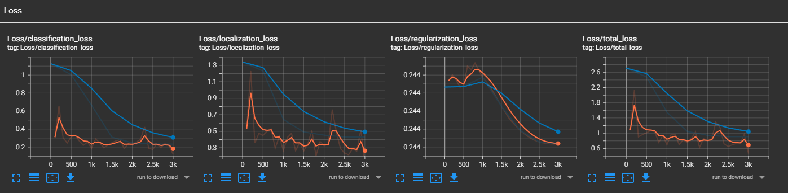
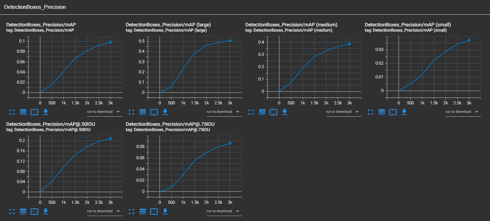
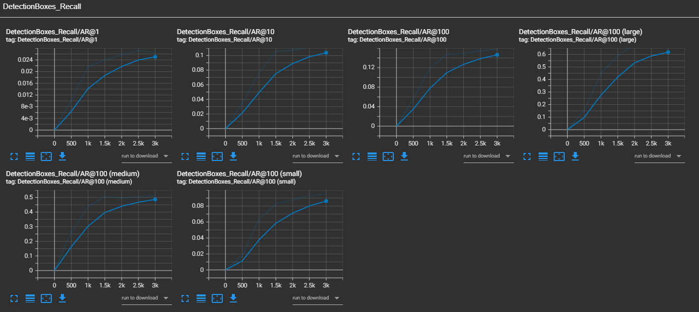

## Write Up

### Project overview
This section should contain a brief description of the project and what we are trying to achieve. Why is object detection such an important component of self driving car systems?

One of the important factors in autonomous driving is safety, and in order for a vehicle to drive on its own, it must be able to grasp objects in its surroundings.
Only then can you drive safely.

### Set up
This section should contain a brief description of the steps to follow to run the code for this repository.

1. First of all, I downloaded the basic work structure from the udacity workspace and worked in the local environment.

2. There was no tf record file in the /data/test folder, so I received the file name below and tested it.
`segment-12200383401366682847_2552_140_2572_140_with_camera_labels`
`segment-1208303279778032257_1360_000_1380_000_with_camera_labels`
`segment-12012663867578114640_820_000_840_000_with_camera_labels`

3. Now you are ready for training. As we explain during the course, the Tf Object Detection API relies on **config files**. The config that we will use for this project is `pipeline.config`, which is the config for a SSD Resnet 50 640x640 model. You can learn more about the Single Shot Detector [here](https://arxiv.org/pdf/1512.02325.pdf).

First, let's download the [pretrained model](http://download.tensorflow.org/models/object_detection/tf2/20200711/ssd_resnet50_v1_fpn_640x640_coco17_tpu-8.tar.gz) and move it to `/home/workspace/experiments/pretrained_model/`.
```
cd /home/workspace/experiments/pretrained_model/
wget http://download.tensorflow.org/models/object_detection/tf2/20200711/ssd_resnet50_v1_fpn_640x640_coco17_tpu-8.tar.gz
tar -xvzf ssd_resnet50_v1_fpn_640x640_coco17_tpu-8.tar.gz
rm -rf ssd_resnet50_v1_fpn_640x640_coco17_tpu-8.tar.gz
```

4. After modifying the `pipeline.config`, execute the command below
```
python edit_config.py --train_dir /home/workspace/data/train/ --eval_dir /home/workspace/data/val/ --batch_size 2 --checkpoint /home/workspace/experiments/pretrained_model/ssd_resnet50_v1_fpn_640x640_coco17_tpu-8/checkpoint/ckpt-0 --label_map /home/workspace/experiments/label_map.pbtxt
```
Model and training hyperparameters are defined using a file, pipeline_new.config.
You can make changes in this config file, then move the `pipeline_new.config` to the `/home/workspace/experiments/reference` folder. Now launch the training process:

5. A training process
```
python experiments/model_main_tf2.py --model_dir=experiments/reference/ --pipeline_config_path=experiments/reference/pipeline_new.config
```
Once the training is finished, launch the evaluation process:
6. An evaluation process:
```
python experiments/model_main_tf2.py --model_dir=experiments/reference/ --pipeline_config_path=experiments/reference/pipeline_new.config --checkpoint_dir=experiments/reference/
```
7. Tensor bord
To monitor the training, you can launch a tensorboard instance by running `python -m tensorboard.main --logdir experiments/reference/`. You will report your findings in the writeup.

### Dataset
#### Dataset analysis

Dataset is very skewed in terms of number of samples available for each class. Class 1 of cars have maximum samples. Class 4 of cyclists is very rare in the dataset, followed by Class 2 of pedestrians.




#### Cross validation

The data is already split into 86 files for trains and 10 files for validation in the workspace.
But I added 3 test files.

### Training
#### Experiment
Used SGD with momentum.
Rate decay: Cosine anealing. 
Changed warmup learning rate to 5e-4, warmup steps to 300 and total steps to 3000 to get the desired learning rate function.
```
optimizer {
    momentum_optimizer {
      learning_rate {
        cosine_decay_learning_rate {
          learning_rate_base: 0.0004
          total_steps: 3000
          warmup_learning_rate: 0.0004
          warmup_steps: 300
        }
      }
      momentum_optimizer_value: 0.9
    }
    use_moving_average: false
}
```
I stopped training at step 3k because the model seemed to start overfitting.


### Result

#### Training result
    
    
    


#### Test result

`segment-12200383401366682847_2552_140_2572_140_with_camera_labels.tfrecord`
    


`segment-1208303279778032257_1360_000_1380_000_with_camera_labels.tfrecord`
    


`segment-12012663867578114640_820_000_840_000_with_camera_labels.tfrecord`
    
