# SDCND : Sensor Fusion and Tracking

The project consists of two major parts: 
1. **Object detection**: In this part, a deep-learning approach is used to detect vehicles in LiDAR data based on a birds-eye view perspective of the 3D point-cloud. Also, a series of performance measures is used to evaluate the performance of the detection approach. 
2. **Object tracking** : In this part, an extended Kalman filter is used to track vehicles over time, based on the lidar detections fused with camera detections. Data association and track management are implemented as well.

The following diagram contains an outline of the data flow and of the individual steps that make up the algorithm. 


## Project File Structure

📦project<br>
 ┣ 📂dataset --> contains the Waymo Open Dataset sequences <br>
 ┃<br>
 ┣ 📂misc<br>
 ┃ ┣ evaluation.py --> plot functions for tracking visualization and RMSE calculation<br>
 ┃ ┣ helpers.py --> misc. helper functions, e.g. for loading / saving binary files<br>
 ┃ ┗ objdet_tools.py --> object detection functions without student tasks<br>
 ┃ ┗ params.py --> parameter file for the tracking part<br>
 ┃ <br>
 ┣ 📂results --> binary files with pre-computed intermediate results<br>
 ┃ <br>
 ┣ 📂student <br>
 ┃ ┣ association.py --> data association logic for assigning measurements to tracks incl. student tasks <br>
 ┃ ┣ filter.py --> extended Kalman filter implementation incl. student tasks <br>
 ┃ ┣ measurements.py --> sensor and measurement classes for camera and lidar incl. student tasks <br>
 ┃ ┣ objdet_detect.py --> model-based object detection incl. student tasks <br>
 ┃ ┣ objdet_eval.py --> performance assessment for object detection incl. student tasks <br>
 ┃ ┣ objdet_pcl.py --> point-cloud functions, e.g. for birds-eye view incl. student tasks <br>
 ┃ ┗ trackmanagement.py --> track and track management classes incl. student tasks  <br>
 ┃ <br>
 ┣ 📂tools --> external tools<br>
 ┃ ┣ 📂objdet_models --> models for object detection<br>
 ┃ ┃ ┃<br>
 ┃ ┃ ┣ 📂darknet<br>
 ┃ ┃ ┃ ┣ 📂config<br>
 ┃ ┃ ┃ ┣ 📂models --> darknet / yolo model class and tools<br>
 ┃ ┃ ┃ ┣ 📂pretrained --> copy pre-trained model file here<br>
 ┃ ┃ ┃ ┃ ┗ complex_yolov4_mse_loss.pth<br>
 ┃ ┃ ┃ ┣ 📂utils --> various helper functions<br>
 ┃ ┃ ┃<br>
 ┃ ┃ ┗ 📂resnet<br>
 ┃ ┃ ┃ ┣ 📂models --> fpn_resnet model class and tools<br>
 ┃ ┃ ┃ ┣ 📂pretrained --> copy pre-trained model file here <br>
 ┃ ┃ ┃ ┃ ┗ fpn_resnet_18_epoch_300.pth <br>
 ┃ ┃ ┃ ┣ 📂utils --> various helper functions<br>
 ┃ ┃ ┃<br>
 ┃ ┗ 📂waymo_reader --> functions for light-weight loading of Waymo sequences<br>
 ┃<br>
 ┣ basic_loop.py<br>
 ┣ loop_over_dataset.py<br>


## Installation Instructions for Running Locally
### Cloning the Project
In order to create a local copy of the project, please click on "Code" and then "Download ZIP". Alternatively, you may of-course use GitHub Desktop or Git Bash for this purpose. 

### Python
The project has been written using Python 3.7. Please make sure that your local installation is equal or above this version. 

### Package Requirements
All dependencies required for the project have been listed in the file `requirements.txt`. You may either install them one-by-one using pip or you can use the following command to install them all at once: 
`pip3 install -r requirements.txt` 

### Waymo Open Dataset Reader
The Waymo Open Dataset Reader is a very convenient toolbox that allows you to access sequences from the Waymo Open Dataset without the need of installing all of the heavy-weight dependencies that come along with the official toolbox. The installation instructions can be found in `tools/waymo_reader/README.md`. 

### Waymo Open Dataset Files
This project makes use of three different sequences to illustrate the concepts of object detection and tracking. These are: 
- Sequence 1 : `training_segment-1005081002024129653_5313_150_5333_150_with_camera_labels.tfrecord`
- Sequence 2 : `training_segment-10072231702153043603_5725_000_5745_000_with_camera_labels.tfrecord`
- Sequence 3 : `training_segment-10963653239323173269_1924_000_1944_000_with_camera_labels.tfrecord`

To download these files, you will have to register with Waymo Open Dataset first: [Open Dataset – Waymo](https://waymo.com/open/terms), if you have not already, making sure to note "Udacity" as your institution.

Once you have done so, please [click here](https://console.cloud.google.com/storage/browser/waymo_open_dataset_v_1_2_0_individual_files) to access the Google Cloud Container that holds all the sequences. Once you have been cleared for access by Waymo (which might take up to 48 hours), you can download the individual sequences. 

The sequences listed above can be found in the folder "training". Please download them and put the `tfrecord`-files into the `dataset` folder of this project.


### Pre-Trained Models
The object detection methods used in this project use pre-trained models which have been provided by the original authors. They can be downloaded [here](https://drive.google.com/file/d/1Pqx7sShlqKSGmvshTYbNDcUEYyZwfn3A/view?usp=sharing) (darknet) and [here](https://drive.google.com/file/d/1RcEfUIF1pzDZco8PJkZ10OL-wLL2usEj/view?usp=sharing) (fpn_resnet). Once downloaded, please copy the model files into the paths `/tools/objdet_models/darknet/pretrained` and `/tools/objdet_models/fpn_resnet/pretrained` respectively.

### Using Pre-Computed Results

In the main file `loop_over_dataset.py`, you can choose which steps of the algorithm should be executed. If you want to call a specific function, you simply need to add the corresponding string literal to one of the following lists: 

- `exec_data` : controls the execution of steps related to sensor data. 
  - `pcl_from_rangeimage` transforms the Waymo Open Data range image into a 3D point-cloud
  - `load_image` returns the image of the front camera

- `exec_detection` : controls which steps of model-based 3D object detection are performed
  - `bev_from_pcl` transforms the point-cloud into a fixed-size birds-eye view perspective
  - `detect_objects` executes the actual detection and returns a set of objects (only vehicles) 
  - `validate_object_labels` decides which ground-truth labels should be considered (e.g. based on difficulty or visibility)
  - `measure_detection_performance` contains methods to evaluate detection performance for a single frame

In case you do not include a specific step into the list, pre-computed binary files will be loaded instead. This enables you to run the algorithm and look at the results even without having implemented anything yet. The pre-computed results for the mid-term project need to be loaded using [this](https://drive.google.com/drive/folders/1-s46dKSrtx8rrNwnObGbly2nO3i4D7r7?usp=sharing) link. Please use the folder `darknet` first. Unzip the file within and put its content into the folder `results`.

- `exec_tracking` : controls the execution of the object tracking algorithm

- `exec_visualization` : controls the visualization of results
  - `show_range_image` displays two LiDAR range image channels (range and intensity)
  - `show_labels_in_image` projects ground-truth boxes into the front camera image
  - `show_objects_and_labels_in_bev` projects detected objects and label boxes into the birds-eye view
  - `show_objects_in_bev_labels_in_camera` displays a stacked view with labels inside the camera image on top and the birds-eye view with detected objects on the bottom
  - `show_tracks` displays the tracking results
  - `show_detection_performance` displays the performance evaluation based on all detected 
  - `make_tracking_movie` renders an output movie of the object tracking results

Even without solving any of the tasks, the project code can be executed. 

The final project uses pre-computed lidar detections in order for all students to have the same input data. If you use the workspace, the data is prepared there already. Otherwise, [download the pre-computed lidar detections](https://drive.google.com/drive/folders/1IkqFGYTF6Fh_d8J3UjQOSNJ2V42UDZpO?usp=sharing) (~1 GB), unzip them and put them in the folder `results`.


# Writeup: 3D Object detection (Midterm)

We have used the Waymo Open Dataset's real-world data and used 3d point cloud for lidar based object detection.

* Configuring the ranges channel to 8 bit and view the range /intensity image (ID_S1_EX1)
* Use the Open3D library to display the lidar point cloud on a 3d viewer and identifying 10 images from point cloud.(ID_S1_EX2)
* Create Birds Eye View perspective (BEV) of the point cloud,assign lidar intensity values to BEV,normalize the heightmap of each BEV (ID_S2_EX1,ID_S2_EX2,ID_S2_EX3)
* In addition to YOLO, use the repository and add parameters ,instantiate fpn resnet model(ID_S3_EX1)
* Convert BEV coordinates into pixel coordinates and convert model output to bounding box format (ID_S3_EX2)
* Compute intersection over union, assign detected objects to label if IOU exceeds threshold (ID_S4_EX1)
* Compute false positives and false negatives, precision and recall(ID_S4_EX2,ID_S4_EX3)

The project can be run by running
```
python loop_over_dataset.py
```

## Step-1: Compute Lidar point cloud from Range Image
In this we are first previewing the range image and convert range and intensity channels to 8 bit format. After that, we use the openCV library to stack the range and intensity channel vertically to visualize the image.

* Convert "range" channel to 8 bit
* Convert "intensity" channel to 8 bit
* Stack up range and intensity channels vertically in openCV

The changes are made in `loop_over_dataset.py`
```python
## Select Waymo Open Dataset file and frame numbers
data_filename = 'training_segment-1005081002024129653_5313_150_5333_150_with_camera_labels.tfrecord
show_only_frames = [0, 1]

## Selective execution and visualization
exec_detection = []
exec_tracking = []
exec_visualization = ['show_range_image']
```

Changes are made at `def show_range_image(frame, lidar_name)` in `objdet_pcl.py`
```python
    # step 1 : extract lidar data and range image for the roof-mounted lidar
    lidar = [obj for obj in frame.lasers if obj.name == lidar_name][0]
    if len(lidar.ri_return1.range_image_compressed) > 0: # use first response
        ri = dataset_pb2.MatrixFloat()
        ri.ParseFromString(zlib.decompress(lidar.ri_return1.range_image_compressed))
        ri = np.array(ri.data).reshape(ri.shape.dims)

    # step 2 : extract the range and the intensity channel from the range image
    ri_range = ri[:,:,0]
    ri_intensity = ri[:,:,1]

    # step 3 : set values <0 to zero
    ri_range[ri_range < 0] = 0.0
    ri_intensity[ri_intensity < 0] = 0.0

    # step 4 : map the range channel onto an 8-bit scale and make sure that the full range of values is appropriately considered
    ri_range = (ri_range  - np.min(ri_range)) * 255 / (np.amax(ri_range) - np.amin(ri_range))

    # step 5 : map the intensity channel onto an 8-bit scale and normalize with the difference between the 1- and 99-percentile to mitigate the influence of outliers
    int_min = np.quantile(ri_intensity, 0.01)
    int_max = np.quantile(ri_intensity, 0.99)

    ri_intensity[ri_intensity < int_min] = int_min
    ri_intensity[ri_intensity > int_max] = int_max

    ri_intensity = (ri_intensity - np.min(ri_intensity)) * 255 / (np.amax(ri_intensity) - np.amin(ri_intensity))
    
    # step 6 : stack the range and intensity image vertically using np.vstack and convert the result to an unsigned 8-bit integer
    img_range_intensity = np.vstack([ri_range, ri_intensity]).astype(np.uint8)
```

The range image sample:

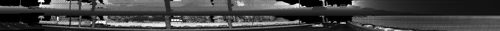

Then, we use the Open3D library to display the lidar point cloud on a 3D viewer and identify 10 images from point cloud

The changes are made in `loop_over_dataset.py`
```python
## Selective execution and visualization
exec_detection = []
exec_tracking = []
exec_visualization = ['show_pcl']
```

Changes are made at `def show_pcl(pcl)` in `objdet_pcl.py`
```python
    # step 1 : initialize open3d with key callback and create window
    viz = o3d.visualization.VisualizerWithKeyCallback()
    ok = viz.create_window(window_name='PCL', width=720, height=720)

    # step 2 : create instance of open3d point-cloud class
    pcd = o3d.geometry.PointCloud()

    # step 3 : set points in pcd instance by converting the point-cloud into 3d vectors (using open3d function Vector3dVector)
    pcd.points = o3d.utility.Vector3dVector(pcl[:, 0:3])

    # step 4 : for the first frame, add the pcd instance to visualization using add_geometry; for all other frames, use update_geometry instead
    viz.add_geometry(pcd)

    # step 5 : visualize point cloud and keep window open until right-arrow is pressed (key-code 262)
    def close_callback(current_viz):
        current_viz.close()
    viz.register_key_callback(262, close_callback)
    viz.run()
```
The Point cloud images:

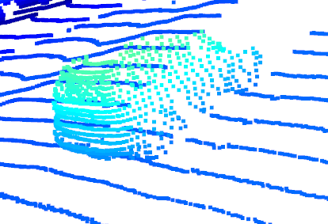
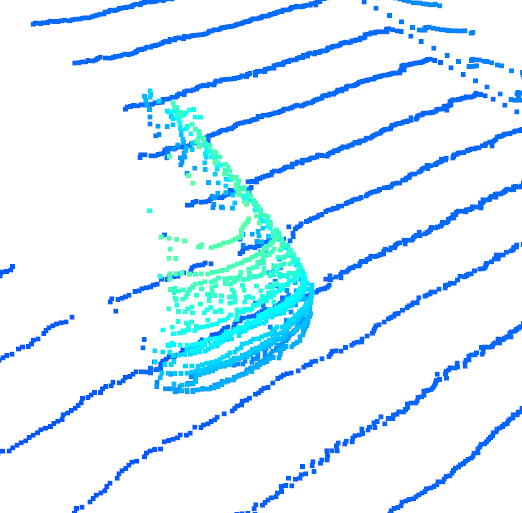
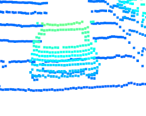 
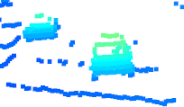
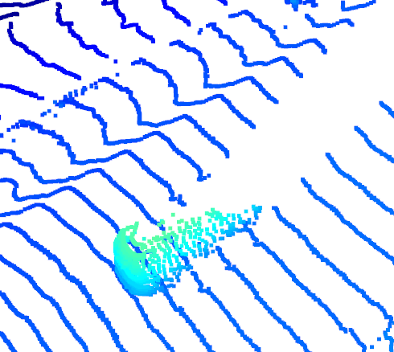 

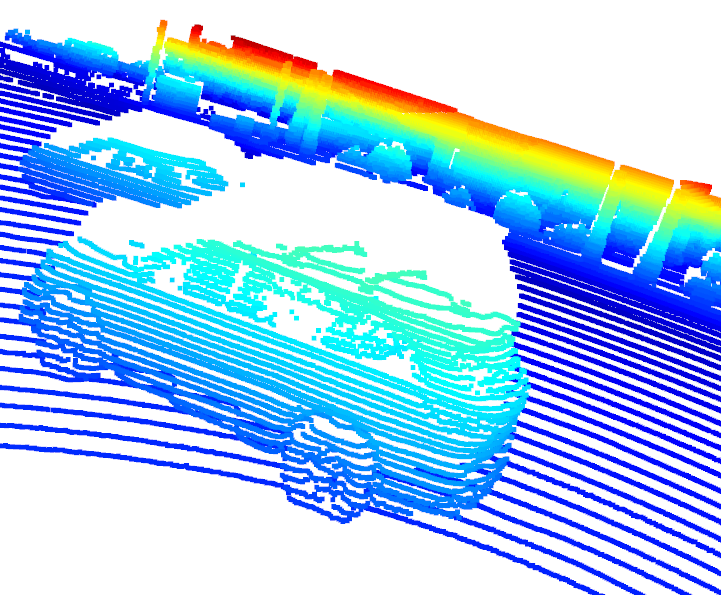 
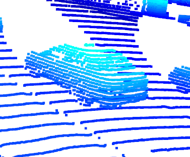
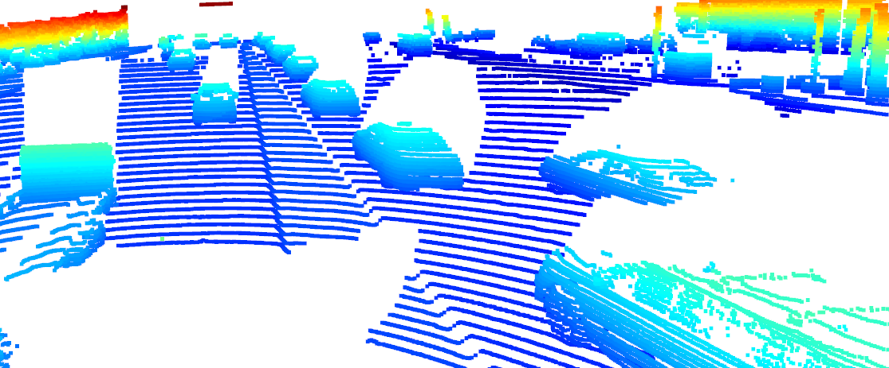 
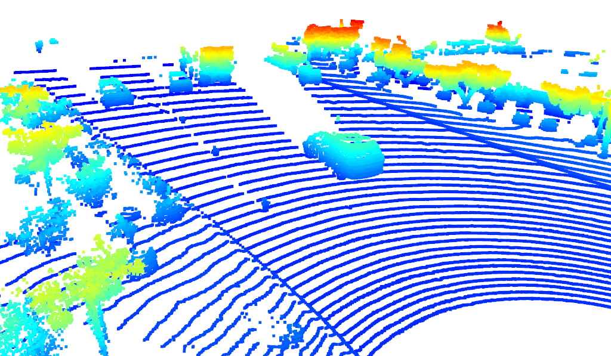

**note**

Stable features include the tail lights, the rear bumper majorly. The exterior and Chassis of the car (like bumper) is the most prominent identifiable feature from the lidar perspective.

## Step-2: Creaate BEV from Lidar PCL
In this case, we are:

* Converting the coordinates to pixel values
* Assigning lidar intensity values to the birds eye view BEV mapping
* Using sorted and pruned point cloud lidar from the previous task
* Normalizing the height map in the BEV
* Compute and map the intensity and height values

The changes are in the `loop_over_dataset.py`
```python
## Selective execution and visualization
exec_detection = ['bev_from_pcl']
exec_tracking = []
exec_visualization = []
```

Changes are made at `def bev_from_pcl(lidar_pcl, configs)` in `objdet_pcl.py`
**convert sensor coordinates to bev-map coordinates (center is bottom-middle)**
```python
    ## step 1 :  compute bev-map discretization by dividing x-range by the bev-image height (see configs)
    bev_discret = (configs.lim_x[1] - configs.lim_x[0]) / configs.bev_height

    ### step 2,3은 평면을 그리드화 하기 위한 코드
    ## step 2 : create a copy of the lidar pcl and transform all metrix x-coordinates into bev-image coordinates    
    lidar_pcl_cpy = np.copy(lidar_pcl)
    lidar_pcl_cpy[:, 0] = np.int_(np.floor(lidar_pcl_cpy[:, 0] / bev_discret))

    ## step 3 : perform the same operation as in step 2 for the y-coordinates but make sure that no negative bev-coordinates occur
    lidar_pcl_cpy[:, 1] = np.int_(np.floor(lidar_pcl_cpy[:, 1] / bev_discret) + (configs.bev_width + 1) / 2)

    ## step 4 : visualize point-cloud using the function show_pcl from a previous task
    show_pcl(lidar_pcl_cpy)
```
The BEV-map:
    
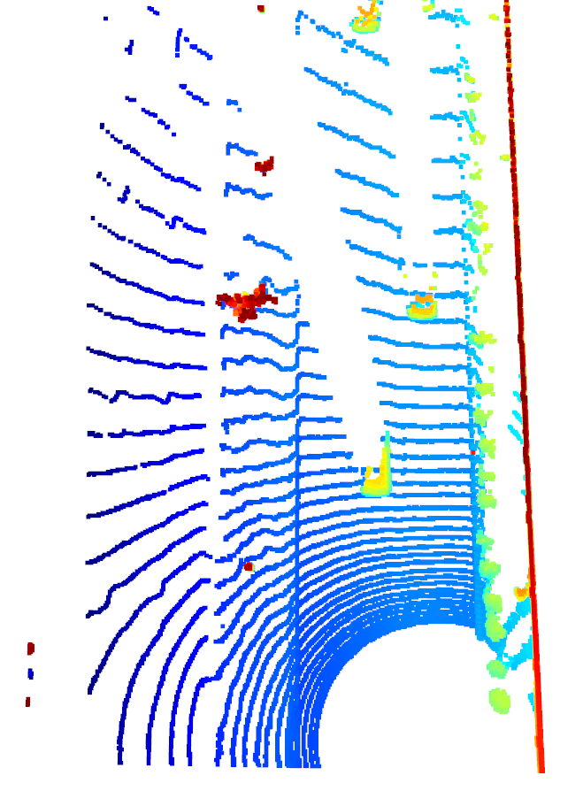


**Compute intensity layer of the BEV map**
```python
    ## step 1 : create a numpy array filled with zeros which has the same dimensions as the BEV map
    intensity_map = np.zeros((configs.bev_height + 1, configs.bev_width + 1))

    ## step 2 : re-arrange elements in lidar_pcl_cpy by sorting first by x, then y, then -z (use numpy.lexsort)
    """
    lidar_pcl_cpy : lidar_pcl_cpy[:, 0] == x-data, lidar_pcl_cpy[:, 1] == y-data, lidar_pcl_cpy[:, 2] == z-data, lidar_pcl_cpy[:, 0] == intensity-data

    """
    lidar_pcl_cpy[lidar_pcl_cpy[:,3]>1.0,3] = 1.0 # z의 값이 1.0이상인 데이터는 1.0으로 설정
    idx_intensity = np.lexsort((-lidar_pcl_cpy[:, 2], lidar_pcl_cpy[:, 1], lidar_pcl_cpy[:, 0])) # x 정렬 -> y 정렬 -> z 정렬
    lidar_pcl_top = lidar_pcl_cpy[idx_intensity] # 정렬된 Lidar PCL 재생성

    ## step 3 : extract all points with identical x and y such that only the top-most z-coordinate is kept (use numpy.unique)
    ##          also, store the number of points per x,y-cell in a variable named "counts" for use in the next task
    _, indices, _ = np.unique(lidar_pcl_cpy[:, 0:2], axis=0, return_index=True, return_counts=True) # 좌표가 같은 점들을 묶은 좌표 인덱스 반환
    lidar_pcl_top = lidar_pcl_cpy[indices]

    ## step 4 : assign the intensity value of each unique entry in lidar_top_pcl to the intensity map 
    ##          make sure that the intensity is scaled in such a way that objects of interest (e.g. vehicles) are clearly visible    
    ##          also, make sure that the influence of outliers is mitigated by normalizing intensity on the difference between the max. and min. value within the point cloud
    ## intensity_map의 x-y 평면에 intensity 값을 대입 (x-y의 데이터는 좌표를 생성하는데에만 사용)
    """
    lidar_pcl_top[:, 3] / (np.amax(lidar_pcl_top[:, 3]) - np.amin(lidar_pcl_top[:, 3])) -> intensity 값 정규화
    intensity_map[np.int_(lidar_pcl_top[:, 0]), np.int_(lidar_pcl_top[:, 1])] -> 정규화된 intensity값의 좌표
    BEV_map 의 크기와 같은 intensity_map 에 intensity 값을 저장하느 코드
    """
    intensity_map[np.int_(lidar_pcl_top[:, 0]), np.int_(lidar_pcl_top[:, 1])] = lidar_pcl_top[:, 3] / (np.amax(lidar_pcl_top[:, 3]) - np.amin(lidar_pcl_top[:, 3]))

    ## step 5 : temporarily visualize the intensity map using OpenCV to make sure that vehicles separate well from the background
    img_intensity = intensity_map * 256
    img_intensity = img_intensity.astype(np.uint8)
    cv2.imshow('img_intensity', img_intensity)
    cv2.waitKey(0)
    cv2.destroyAllWindows()
```
The corresponding intensity channel:

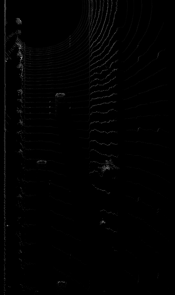

**Compute height layer of the BEV map**
```python
    ## step 1 : create a numpy array filled with zeros which has the same dimensions as the BEV map
    height_map = np.zeros((configs.bev_height + 1, configs.bev_width + 1))

    ## step 2 : assign the height value of each unique entry in lidar_top_pcl to the height map 
    ##          make sure that each entry is normalized on the difference between the upper and lower height defined in the config file
    ##          use the lidar_pcl_top data structure from the previous task to access the pixels of the height_map
    ## height_map의 x-y 평면에 height 값을 대입 (x-y의 데이터는 좌표를 생성하는데에만 사용)
    """
    lidar_pcl_top[:, 2] / float(np.abs(configs.lim_z[1] - configs.lim_z[0])) -> 높이 값 정규화
    height_map[np.int_(lidar_pcl_top[:, 0]), np.int_(lidar_pcl_top[:, 1])] -> 정규화된 높이값의 좌표
    BEV_map 의 크기와 같은 height_map 에 height 값을 저장하느 코드
    """
    height_map[np.int_(lidar_pcl_top[:, 0]), np.int_(lidar_pcl_top[:, 1])] = lidar_pcl_top[:, 2] / float(np.abs(configs.lim_z[1] - configs.lim_z[0]))

    ## step 3 : temporarily visualize the intensity map using OpenCV to make sure that vehicles separate well from the background
    img_height = height_map * 256
    img_height = img_height.astype(np.uint8)
    cv2.imshow('height_map', height_map)
    cv2.waitKey(0)
    cv2.destroyAllWindows()
```
The corresponding height channel:

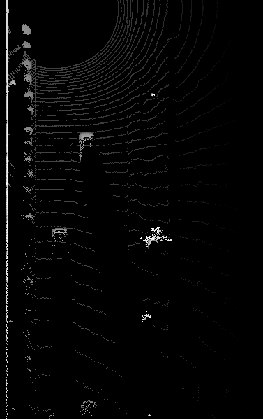

## Step-3: Model Based Object Detection in BEV Image

* Instantiating the fpn resnet model from the cloned repository configs
* Extracting 3d bounding boxes from the responses
* Transforming the pixel to vehicle coordinates
* Model output tuned to the bounding box format [class-id, x, y, z, h, w, l, yaw]

The changes are in the `loop_over_dataset.py`
```python
## Selective execution and visualization
exec_detection = ['bev_from_pcl','detect_objects']
exec_tracking = []
exec_visualization = ['show_objects_in_bev_labels_in_camera']
```

Changes are made at `def detect_objects(input_bev_maps, model, configs)` in `objdet_detect.py`
```python
outputs['hm_cen'] = _sigmoid(outputs['hm_cen'])
outputs['cen_offset'] = _sigmoid(outputs['cen_offset'])
# detections size (batch_size, K, 10)
detections = decode(outputs['hm_cen'], outputs['cen_offset'], outputs['direction'], 
                    outputs['z_coor'], outputs['dim'], K=40) #K=configs.k

detections = detections.cpu().numpy().astype(np.float32)
detections = post_processing(detections, configs)
detections = detections[0][1]
print(detections)
```
As the model input is a three-channel BEV map, the detected objects will be returned with coordinates and properties in the BEV coordinate space. Thus, before the detections can move along in the processing pipeline, they need to be converted into metric coordinates in vehicle space.

A sample preview of the bounding box images:

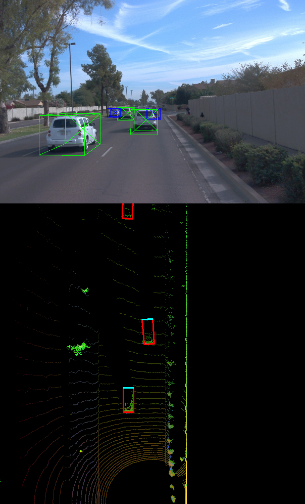

## Step-4: Performance detection for 3D Object Detection

In this step, the performance is computed by getting the IOU between labels and detections to get the false positive and false negative values.The task is to compute the geometric overlap between the bounding boxes of labels and the detected objects:

* Assigning a detected object to a label if IOU exceeds threshold
* Computing the degree of geometric overlap
* For multiple matches objects/detections pair with maximum IOU are kept
* Computing the false negative and false positive values
* Computing precision and recall over the false positive and false negative values

The changes are in the `loop_over_dataset.py`
```python
exec_detection = ['bev_from_pcl','detect_objects','validate_object_labels', 'measure_detection_performance']
exec_tracking = []
exec_visualization = ['show_detection_performance']
```

Changes are made at `def compute_performance_stats(det_performance_all)` and `def measure_detection_performance(detections, labels, labels_valid, min_iou=0.5)` in `objdet_detect.py`

**`def measure_detection_performance(detections, labels, labels_valid, min_iou=0.5)`**
```python
## step 1 : extract the four corners of the current label bounding-box
x_label = label.box.center_x
y_label = label.box.center_y
z_label = label.box.center_z
w_label = label.box.width
l_label = label.box.length
yaw_label = label.box.heading
            
label_corner = tools.compute_box_corners(x_label, y_label,
                                         w_label, l_label, yaw_label)

## step 2 : loop over all detected objects
for detection in detections:

    ## step 3 : extract the four corners of the current detection
    """
    detections have the format [id, x, y, z, h, w, l, yaw], 
    where id denotes the class id for the object type vehicle.
    """
    id_detected, x_detected, y_detected, z_detected, h_detected, w_detected, l_detected, yaw_detected = detection
    detection_corner = tools.compute_box_corners(x_detected, y_detected,
                                                 w_detected, l_detected, yaw_detected)
                
    ## step 4 : computer the center distance between label and detection bounding-box in x, y, and z
    dist_x = np.array(x_label - x_detected).item()
    dist_y = np.array(y_label - y_detected).item()
    dist_z = np.array(z_label - z_detected).item()

    ## step 5 : compute the intersection over union (IOU) between label and detection bounding-box
    label_area = Polygon(label_corner)
    detected_area = Polygon(detection_corner)
    iou = label_area.intersection(detected_area).area / label_area.union(detected_area).area
                
    ## step 6 : if IOU exceeds min_iou threshold, store [iou,dist_x, dist_y, dist_z] in matches_lab_det and increase the TP count
    if iou > min_iou:
        matches_lab_det.append([iou, dist_x, dist_y, dist_z])
        true_positives += 1
```

**`def compute_performance_stats(det_performance_all)`**
```python
## step 1 : compute the total number of positives present in the scene
all_positives = sum(labels_valid)

## step 2 : compute the number of false negatives
false_negatives = all_positives - true_positives

## step 3 : compute the number of false positives
false_positives = len(detections) - true_positives
```

The precision recall curve is plotted showing similar results of precision = 0.977, recall = 0.710:
    
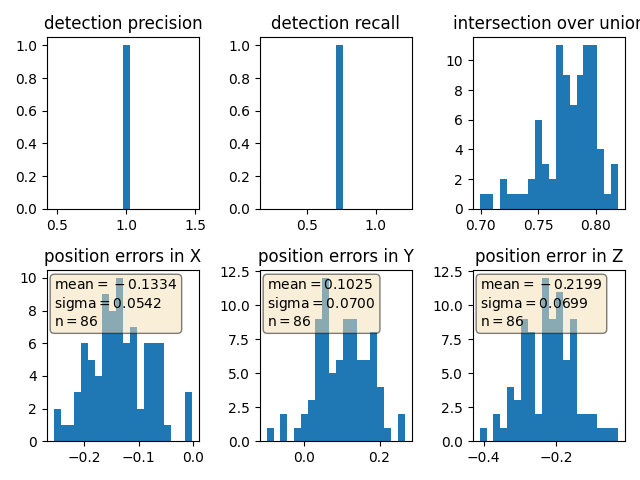

In the next step, we set the
```python
configs_det.use_labels_as_objects=True
```
which results in precision and recall values as 1.This is shown in the following image:

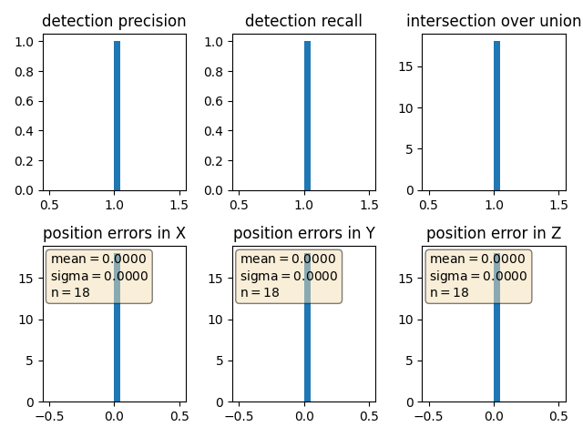
