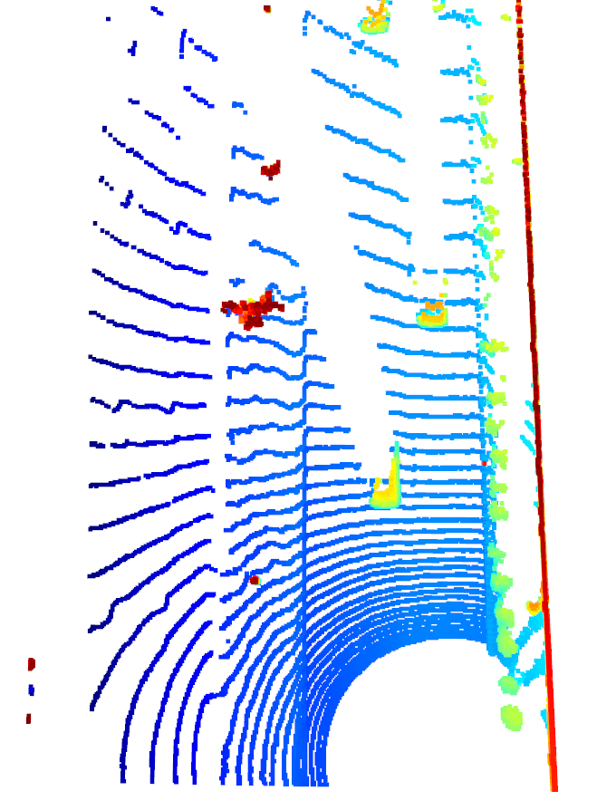
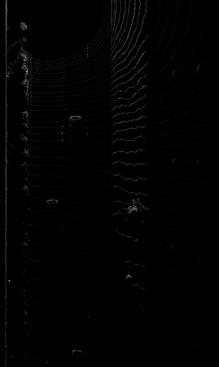
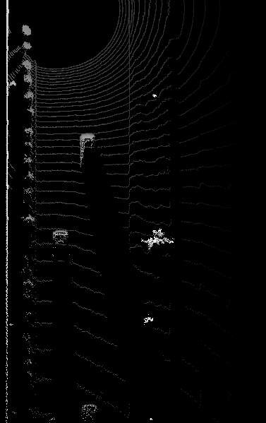
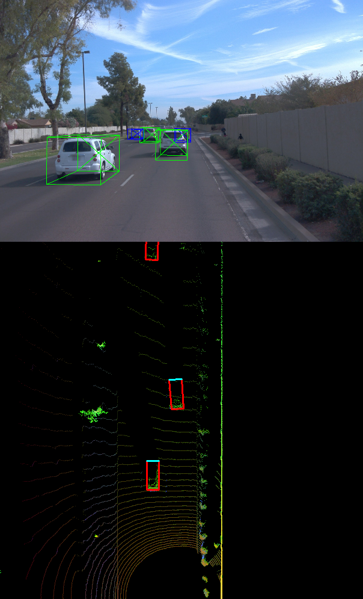
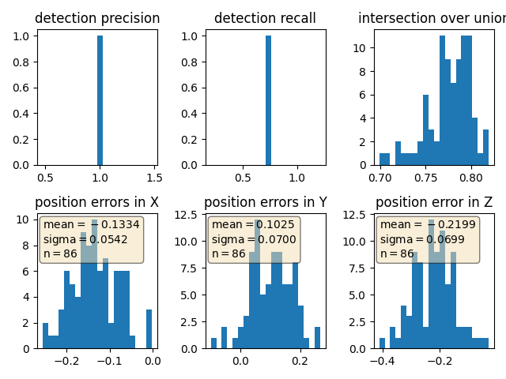
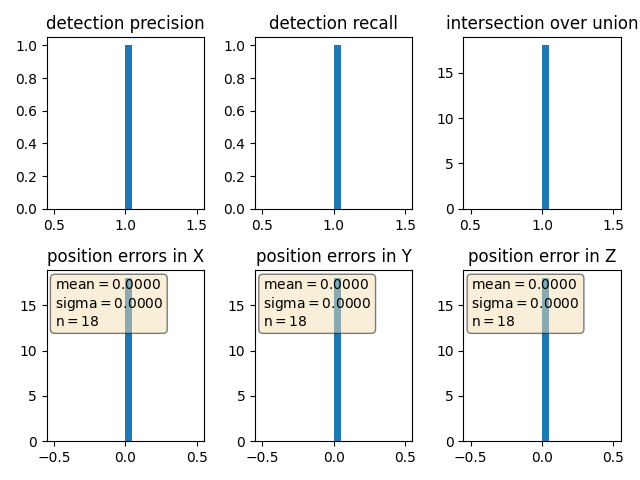

# Writeup: 3D Object detection (Midterm)

We have used the Waymo Open Dataset's real-world data and used 3d point cloud for lidar based object detection.

* Configuring the ranges channel to 8 bit and view the range /intensity image (ID_S1_EX1)
* Use the Open3D library to display the lidar point cloud on a 3d viewer and identifying 10 images from point cloud.(ID_S1_EX2)
* Create Birds Eye View perspective (BEV) of the point cloud,assign lidar intensity values to BEV,normalize the heightmap of each BEV (ID_S2_EX1,ID_S2_EX2,ID_S2_EX3)
* In addition to YOLO, use the repository and add parameters ,instantiate fpn resnet model(ID_S3_EX1)
* Convert BEV coordinates into pixel coordinates and convert model output to bounding box format (ID_S3_EX2)
* Compute intersection over union, assign detected objects to label if IOU exceeds threshold (ID_S4_EX1)
* Compute false positives and false negatives, precision and recall(ID_S4_EX2,ID_S4_EX3)

The project can be run by running
```
python loop_over_dataset.py
```

## Step-1: Compute Lidar point cloud from Range Image
In this we are first previewing the range image and convert range and intensity channels to 8 bit format. After that, we use the openCV library to stack the range and intensity channel vertically to visualize the image.

* Convert "range" channel to 8 bit
* Convert "intensity" channel to 8 bit
* Stack up range and intensity channels vertically in openCV

The changes are made in `loop_over_dataset.py`
```python
## Select Waymo Open Dataset file and frame numbers
data_filename = 'training_segment-1005081002024129653_5313_150_5333_150_with_camera_labels.tfrecord
show_only_frames = [0, 1]

## Selective execution and visualization
exec_detection = []
exec_tracking = []
exec_visualization = ['show_range_image']
```

Changes are made at `def show_range_image(frame, lidar_name)` in `objdet_pcl.py`
```python
    # step 1 : extract lidar data and range image for the roof-mounted lidar
    lidar = [obj for obj in frame.lasers if obj.name == lidar_name][0]
    if len(lidar.ri_return1.range_image_compressed) > 0: # use first response
        ri = dataset_pb2.MatrixFloat()
        ri.ParseFromString(zlib.decompress(lidar.ri_return1.range_image_compressed))
        ri = np.array(ri.data).reshape(ri.shape.dims)

    # step 2 : extract the range and the intensity channel from the range image
    ri_range = ri[:,:,0]
    ri_intensity = ri[:,:,1]

    # step 3 : set values <0 to zero
    ri_range[ri_range < 0] = 0.0
    ri_intensity[ri_intensity < 0] = 0.0

    # step 4 : map the range channel onto an 8-bit scale and make sure that the full range of values is appropriately considered
    ri_range = (ri_range  - np.min(ri_range)) * 255 / (np.amax(ri_range) - np.amin(ri_range))

    # step 5 : map the intensity channel onto an 8-bit scale and normalize with the difference between the 1- and 99-percentile to mitigate the influence of outliers
    int_min = np.quantile(ri_intensity, 0.01)
    int_max = np.quantile(ri_intensity, 0.99)

    ri_intensity[ri_intensity < int_min] = int_min
    ri_intensity[ri_intensity > int_max] = int_max

    ri_intensity = (ri_intensity - np.min(ri_intensity)) * 255 / (np.amax(ri_intensity) - np.amin(ri_intensity))
    
    # step 6 : stack the range and intensity image vertically using np.vstack and convert the result to an unsigned 8-bit integer
    img_range_intensity = np.vstack([ri_range, ri_intensity]).astype(np.uint8)
```

The range image sample:
 

Then, we use the Open3D library to display the lidar point cloud on a 3D viewer and identify 10 images from point cloud

The changes are made in `loop_over_dataset.py`
```python
## Selective execution and visualization
exec_detection = []
exec_tracking = []
exec_visualization = ['show_pcl']
```

Changes are made at `def show_pcl(pcl)` in `objdet_pcl.py`
```python
    # step 1 : initialize open3d with key callback and create window
    viz = o3d.visualization.VisualizerWithKeyCallback()
    ok = viz.create_window(window_name='PCL', width=720, height=720)

    # step 2 : create instance of open3d point-cloud class
    pcd = o3d.geometry.PointCloud()

    # step 3 : set points in pcd instance by converting the point-cloud into 3d vectors (using open3d function Vector3dVector)
    pcd.points = o3d.utility.Vector3dVector(pcl[:, 0:3])

    # step 4 : for the first frame, add the pcd instance to visualization using add_geometry; for all other frames, use update_geometry instead
    viz.add_geometry(pcd)

    # step 5 : visualize point cloud and keep window open until right-arrow is pressed (key-code 262)
    def close_callback(current_viz):
        current_viz.close()
    viz.register_key_callback(262, close_callback)
    viz.run()
```
The Point cloud images:

  
  
  
  
  

**note** Stable features include the tail lights, the rear bumper majorly. The exterior and Chassis of the car (like bumper) is the most prominent identifiable feature from the lidar perspective.

## Step-2: Creaate BEV from Lidar PCL
In this case, we are:

* Converting the coordinates to pixel values
* Assigning lidar intensity values to the birds eye view BEV mapping
* Using sorted and pruned point cloud lidar from the previous task
* Normalizing the height map in the BEV
* Compute and map the intensity and height values

The changes are in the `loop_over_dataset.py`
```python
## Selective execution and visualization
exec_detection = ['bev_from_pcl']
exec_tracking = []
exec_visualization = []
```

Changes are made at `def bev_from_pcl(lidar_pcl, configs)` in `objdet_pcl.py`
**convert sensor coordinates to bev-map coordinates (center is bottom-middle)**
```python
    ## step 1 :  compute bev-map discretization by dividing x-range by the bev-image height (see configs)
    bev_discret = (configs.lim_x[1] - configs.lim_x[0]) / configs.bev_height

    ### step 2,3은 평면을 그리드화 하기 위한 코드
    ## step 2 : create a copy of the lidar pcl and transform all metrix x-coordinates into bev-image coordinates    
    lidar_pcl_cpy = np.copy(lidar_pcl)
    lidar_pcl_cpy[:, 0] = np.int_(np.floor(lidar_pcl_cpy[:, 0] / bev_discret))

    ## step 3 : perform the same operation as in step 2 for the y-coordinates but make sure that no negative bev-coordinates occur
    lidar_pcl_cpy[:, 1] = np.int_(np.floor(lidar_pcl_cpy[:, 1] / bev_discret) + (configs.bev_width + 1) / 2)

    ## step 4 : visualize point-cloud using the function show_pcl from a previous task
    show_pcl(lidar_pcl_cpy)
```
The BEV-map:
 


**Compute intensity layer of the BEV map**
```python
    ## step 1 : create a numpy array filled with zeros which has the same dimensions as the BEV map
    intensity_map = np.zeros((configs.bev_height + 1, configs.bev_width + 1))

    ## step 2 : re-arrange elements in lidar_pcl_cpy by sorting first by x, then y, then -z (use numpy.lexsort)
    """
    lidar_pcl_cpy : lidar_pcl_cpy[:, 0] == x-data, lidar_pcl_cpy[:, 1] == y-data, lidar_pcl_cpy[:, 2] == z-data, lidar_pcl_cpy[:, 0] == intensity-data

    """
    lidar_pcl_cpy[lidar_pcl_cpy[:,3]>1.0,3] = 1.0 # z의 값이 1.0이상인 데이터는 1.0으로 설정
    idx_intensity = np.lexsort((-lidar_pcl_cpy[:, 2], lidar_pcl_cpy[:, 1], lidar_pcl_cpy[:, 0])) # x 정렬 -> y 정렬 -> z 정렬
    lidar_pcl_top = lidar_pcl_cpy[idx_intensity] # 정렬된 Lidar PCL 재생성

    ## step 3 : extract all points with identical x and y such that only the top-most z-coordinate is kept (use numpy.unique)
    ##          also, store the number of points per x,y-cell in a variable named "counts" for use in the next task
    _, indices, _ = np.unique(lidar_pcl_cpy[:, 0:2], axis=0, return_index=True, return_counts=True) # 좌표가 같은 점들을 묶은 좌표 인덱스 반환
    lidar_pcl_top = lidar_pcl_cpy[indices]

    ## step 4 : assign the intensity value of each unique entry in lidar_top_pcl to the intensity map 
    ##          make sure that the intensity is scaled in such a way that objects of interest (e.g. vehicles) are clearly visible    
    ##          also, make sure that the influence of outliers is mitigated by normalizing intensity on the difference between the max. and min. value within the point cloud
    ## intensity_map의 x-y 평면에 intensity 값을 대입 (x-y의 데이터는 좌표를 생성하는데에만 사용)
    """
    lidar_pcl_top[:, 3] / (np.amax(lidar_pcl_top[:, 3]) - np.amin(lidar_pcl_top[:, 3])) -> intensity 값 정규화
    intensity_map[np.int_(lidar_pcl_top[:, 0]), np.int_(lidar_pcl_top[:, 1])] -> 정규화된 intensity값의 좌표
    BEV_map 의 크기와 같은 intensity_map 에 intensity 값을 저장하느 코드
    """
    intensity_map[np.int_(lidar_pcl_top[:, 0]), np.int_(lidar_pcl_top[:, 1])] = lidar_pcl_top[:, 3] / (np.amax(lidar_pcl_top[:, 3]) - np.amin(lidar_pcl_top[:, 3]))

    ## step 5 : temporarily visualize the intensity map using OpenCV to make sure that vehicles separate well from the background
    img_intensity = intensity_map * 256
    img_intensity = img_intensity.astype(np.uint8)
    cv2.imshow('img_intensity', img_intensity)
    cv2.waitKey(0)
    cv2.destroyAllWindows()
```
The corresponding intensity channel:
 

**Compute height layer of the BEV map**
```python
    ## step 1 : create a numpy array filled with zeros which has the same dimensions as the BEV map
    height_map = np.zeros((configs.bev_height + 1, configs.bev_width + 1))

    ## step 2 : assign the height value of each unique entry in lidar_top_pcl to the height map 
    ##          make sure that each entry is normalized on the difference between the upper and lower height defined in the config file
    ##          use the lidar_pcl_top data structure from the previous task to access the pixels of the height_map
    ## height_map의 x-y 평면에 height 값을 대입 (x-y의 데이터는 좌표를 생성하는데에만 사용)
    """
    lidar_pcl_top[:, 2] / float(np.abs(configs.lim_z[1] - configs.lim_z[0])) -> 높이 값 정규화
    height_map[np.int_(lidar_pcl_top[:, 0]), np.int_(lidar_pcl_top[:, 1])] -> 정규화된 높이값의 좌표
    BEV_map 의 크기와 같은 height_map 에 height 값을 저장하느 코드
    """
    height_map[np.int_(lidar_pcl_top[:, 0]), np.int_(lidar_pcl_top[:, 1])] = lidar_pcl_top[:, 2] / float(np.abs(configs.lim_z[1] - configs.lim_z[0]))

    ## step 3 : temporarily visualize the intensity map using OpenCV to make sure that vehicles separate well from the background
    img_height = height_map * 256
    img_height = img_height.astype(np.uint8)
    cv2.imshow('height_map', height_map)
    cv2.waitKey(0)
    cv2.destroyAllWindows()
```
The corresponding height channel:
 

## Step-3: Model Based Object Detection in BEV Image

* Instantiating the fpn resnet model from the cloned repository configs
* Extracting 3d bounding boxes from the responses
* Transforming the pixel to vehicle coordinates
* Model output tuned to the bounding box format [class-id, x, y, z, h, w, l, yaw]

The changes are in the `loop_over_dataset.py`
```python
## Selective execution and visualization
exec_detection = ['bev_from_pcl','detect_objects']
exec_tracking = []
exec_visualization = ['show_objects_in_bev_labels_in_camera']
```

Changes are made at `def detect_objects(input_bev_maps, model, configs)` in `objdet_detect.py`
```python
outputs['hm_cen'] = _sigmoid(outputs['hm_cen'])
outputs['cen_offset'] = _sigmoid(outputs['cen_offset'])
# detections size (batch_size, K, 10)
detections = decode(outputs['hm_cen'], outputs['cen_offset'], outputs['direction'], 
                    outputs['z_coor'], outputs['dim'], K=40) #K=configs.k

detections = detections.cpu().numpy().astype(np.float32)
detections = post_processing(detections, configs)
detections = detections[0][1]
print(detections)
```
As the model input is a three-channel BEV map, the detected objects will be returned with coordinates and properties in the BEV coordinate space. Thus, before the detections can move along in the processing pipeline, they need to be converted into metric coordinates in vehicle space.

A sample preview of the bounding box images:
 

## Step-4: Performance detection for 3D Object Detection

In this step, the performance is computed by getting the IOU between labels and detections to get the false positive and false negative values.The task is to compute the geometric overlap between the bounding boxes of labels and the detected objects:

* Assigning a detected object to a label if IOU exceeds threshold
* Computing the degree of geometric overlap
* For multiple matches objects/detections pair with maximum IOU are kept
* Computing the false negative and false positive values
* Computing precision and recall over the false positive and false negative values

The changes are in the `loop_over_dataset.py`
```python
exec_detection = ['bev_from_pcl','detect_objects','validate_object_labels', 'measure_detection_performance']
exec_tracking = []
exec_visualization = ['show_detection_performance']
```

Changes are made at `def compute_performance_stats(det_performance_all)` and `def measure_detection_performance(detections, labels, labels_valid, min_iou=0.5)` in `objdet_detect.py`

**`def measure_detection_performance(detections, labels, labels_valid, min_iou=0.5)`**
```python
## step 1 : extract the four corners of the current label bounding-box
x_label = label.box.center_x
y_label = label.box.center_y
z_label = label.box.center_z
w_label = label.box.width
l_label = label.box.length
yaw_label = label.box.heading
            
label_corner = tools.compute_box_corners(x_label, y_label,
                                         w_label, l_label, yaw_label)

## step 2 : loop over all detected objects
for detection in detections:

    ## step 3 : extract the four corners of the current detection
    """
    detections have the format [id, x, y, z, h, w, l, yaw], 
    where id denotes the class id for the object type vehicle.
    """
    id_detected, x_detected, y_detected, z_detected, h_detected, w_detected, l_detected, yaw_detected = detection
    detection_corner = tools.compute_box_corners(x_detected, y_detected,
                                                 w_detected, l_detected, yaw_detected)
                
    ## step 4 : computer the center distance between label and detection bounding-box in x, y, and z
    dist_x = np.array(x_label - x_detected).item()
    dist_y = np.array(y_label - y_detected).item()
    dist_z = np.array(z_label - z_detected).item()

    ## step 5 : compute the intersection over union (IOU) between label and detection bounding-box
    label_area = Polygon(label_corner)
    detected_area = Polygon(detection_corner)
    iou = label_area.intersection(detected_area).area / label_area.union(detected_area).area
                
    ## step 6 : if IOU exceeds min_iou threshold, store [iou,dist_x, dist_y, dist_z] in matches_lab_det and increase the TP count
    if iou > min_iou:
        matches_lab_det.append([iou, dist_x, dist_y, dist_z])
        true_positives += 1
```

**`def compute_performance_stats(det_performance_all)`**
```python
## step 1 : compute the total number of positives present in the scene
all_positives = sum(labels_valid)

## step 2 : compute the number of false negatives
false_negatives = all_positives - true_positives

## step 3 : compute the number of false positives
false_positives = len(detections) - true_positives
```

The precision recall curve is plotted showing similar results of precision = 0.977, recall = 0.710
 

In the next step, we set the
```python
configs_det.use_labels_as_objects=True
```
which results in precision and recall values as 1.This is shown in the following image:
 

## Summary of Lidar based 3D Object Detection
From the project, it is understandable that for a stabilized tracking, lidar should be used . The conversion of range data to point cloud through spatial volumes, or points (or CNN networks) are important for further analysis. The usage of resnet/darknet and YOLO to convert these high dimensional point cloud representations to object detections through bounding boxes is essential for 3D object detection. Evaluating the performance with help of maximal IOU mapping ,mAP, and representing the precision/recall of the bounding boxes are essential to understand the effectiveness of Lidar based detection.
