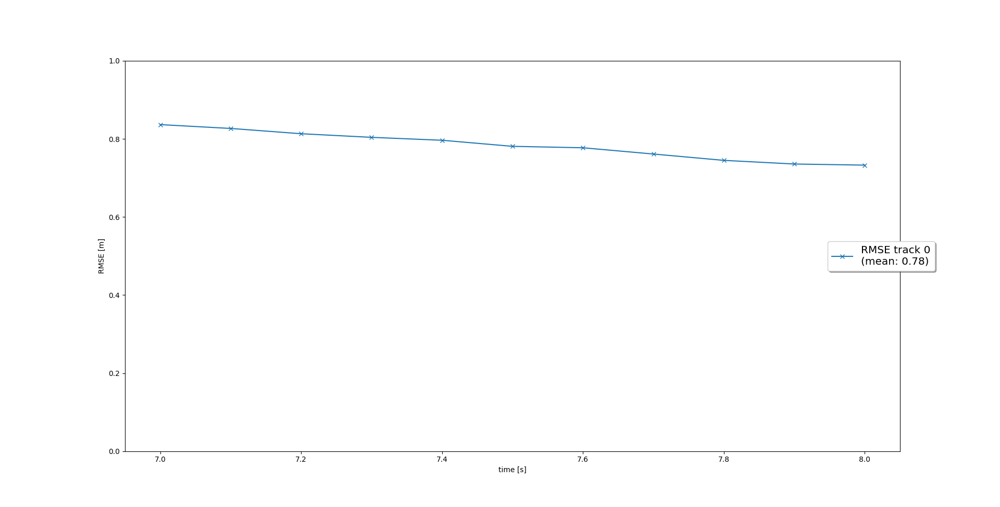

# Writeup: Sensor Fusion and Object Tracking (Finalterm)

## 1. Write a short recap of the four tracking steps and what you implemented there (filter, track management, association, camera fusion). Which results did you achieve? Which part of the project was most difficult for you to complete, and why?

Tracking steps is implementation of EKF, track management, data association, and camera-lidar fusion.
In the track management section, it was difficult to delete the track when to delete the track.

## 2. Do you see any benefits in camera-lidar fusion compared to lidar-only tracking (in theory and in your concrete results)? 

For a stabilized tracking Sensor fusion should combine multiple sensors. 

Cameras may offer color, brightness, contrast based images that Lidar does not provide. on the other hand, Lidar is extremely beneficial for low brightness, visibility or weather conditions.

The most important aspect of the lidar is that it can be measured in three dimensions, but it is difficult for the camera to extract distance three-dimensional information from the image plane.

## 3. Which challenges will a sensor fusion system face in real-life scenarios? Did you see any of these challenges in the project?

1. Multiple tracks and measurements provide a precise correlation. The thresholds for gatting should be properly set to avoid un-necessary wrong correlations.

2. The measurement noise configuration is insufficient to provide a precise project result. In reality, rather than setting a standardized noise variance for a sensor, it's best if each measurement has its noise variance.Individual noise variances provide a better vaiation as compared to a combined variance on the sensor.

## 4. Can you think of ways to improve your tracking results in the future?

Currently, the camera-lidar is implemented with an extended Kalman filter. We have implemented sensor fusion.
I want to implement sensor fusion using an unscented Kalman filter.

The extended Kalman filter linearizes nonlinear functions through differentiation, which is advantageous for fast computer operations due to low computational time, but has low accuracy.
On the other hand, unscented Kalman filters have higher accuracy than extended Kalman filters because they obtain nonlinear functions themselves.


## Step-1: Extended Kalman Filter

you will implement an EKF to track a single real-world target with lidar measurement input over time

**Task**

* The single track is already initialized for you, so don't worry about track initialization right now.

* In `student/filter.py`, implement the `predict()` function for an EKF. Implement the `F()` and `Q()` functions to calculate a system matrix for constant velocity process model in 3D and the corresponding process noise covariance depending on the current timestep dt. Note that in our case, dt is fixed and you should load it from `misc/params.py`. However, in general, the timestep might vary. At the end of the prediction step, save the resulting x and P by calling the functions `set_x()` and `set_P()` that are already implemented in `student/trackmanagement.py.`

* Implement the `update()` function as well as the `gamma()` and `S()` functions for residual and residual covariance. You should call the functions `get_hx` and `get_H` that are already implemented in `students/measurements.py` to get the measurement function evaluated at the current state, h(x), and the Jacobian H. Note that we have a linear measurement model for lidar, so h(x)=H*x for now. You should use h(x) nevertheless for the residual to have an EKF ready for the nonlinear camera measurement model you'll need in Step 4. Again, at the end of the update step, save the resulting x and P by calling the functions `set_x()` and set_`P()` that are already implemented in `student/trackmanagement.py`.

* Use `numpy.matrix()` for all matrices as learned in the exercises.

**Hint**

* We now want to track 3D objects with a constant velocity model including height estimation, so F and Q will be 6D matrices, in comparison to our 2D tracking in the lesson exercise where we assumed a flat world. Therefore, you need to implement the following matrices: [TODO: include image of Latex formulas]

* Remember from the repository overview on the last page that there is a `Track` class and a `Measurement` class. These classes define your input to the `predict()` and `update()` functions. So you can get the track data by calling `track.x` and `track.P`, the measurement data by calling `meas.z` and `meas.R`. Also note that the measurement has an attribute sensor that tells us which sensor generated this measurement, so you can get the measurement matrix by calling `meas.sensor.get_H()`. Take a closer look at the two classes for clarification.

* Note that you don't have a running track management yet, therefore the track state is fixed at 'confirmed' and the score remains at the initial value zero.

* From `misc/params.py`, you should load the following parameters: `dt`, `q`, `dim_state`.

The project can be run by running
```
python loop_over_dataset.py
```

The changes are made in `loop_over_dataset.py`
```python
## Select Waymo Open Dataset file and frame numbers
data_filename = 'training_segment-10072231702153043603_5725_000_5745_000_with_camera_labels.tfrecord' # Sequence 2
show_only_frames = [150, 200] # show only frames in interval for debugging
sequence = "2"

## Initialize object detection
configs_det = det.load_configs(model_name='fpn_resnet') # options are 'darknet', 'fpn_resnet'
model_det = det.create_model(configs_det)

# Midterm, Finalterm의 results_fullpath를 결정해주는 flag (True : Midterm, False : Finalterm)
path_flag = False

## Uncomment this setting to restrict the y-range in the Final project
## comment this setting to restrict the y-range in the Mid project
configs_det.lim_y = [-5, 10] 

## Selective execution and visualization
exec_detection = []
exec_tracking = ['perform_tracking']
exec_visualization = ['show_tracks']
```

Changes are made in `filter.py`

* We first design the system states [x, y, z, vx, vy, vz], process model, and constant velocity model.
* Then we calculate the matrix (system matrix) for the 3D process models with constant velocity and noise covariances. This is required for computing state h(x) and Jacobian H
* For current state calculation, h(x), and the Jacobian H function are evaluated.
* The Kalman gain is computed and is used for updating the state and covariance.

**`F(self)`**
This function is constant velocity process model for tracking

```python
F = np.identity(self.dim_state)
        F[0,3] = self.dt
        F[1,4] = self.dt
        F[2,5] = self.dt

        return np.matrix(F)
```

**`Q(self)`**
This function is constant velocity process noise covariance for tracking

```python
q3 = (self.dt**3)*self.q / 3
        q2 = (self.dt**2)*self.q / 2
        q1 = self.dt*self.q

        return np.matrix([[q3,  0,   0,   q2,  0,   0],
                          [0,   q3,  0,   0,   q2,  0],
                          [0,   0,   q3,  0,   0,   q2],
                          [q2,  0,   0,   q1,  0,   0],
                          [0,   q2,  0,   0,   q1,  0],
                          [0,   0,   q2,  0,   0,   q1]])
```

**`predict(self, track)`**
predict state x and estimation error covariance P to next timestep, save x and P in track

```python
x = self.F() * track.x
        P = self.F() * track.P * self.F().transpose() + self.Q()

        track.set_x(x)
        track.set_P(P)
```

**`update(self, track, meas)`**
update state x and covariance P with associated measurement, save x and P in track

```python
H = meas.sensor.get_H(track.x)
        gamma = self.gamma(track, meas)
        S = self.S(track, meas, H)
        K = track.P * H.transpose() * np.linalg.inv(S)

        x = track.x + K * gamma
        P = (np.identity(self.dim_state) - K * H) * track.P

        track.set_x(x)
        track.set_P(P)
        track.update_attributes(meas)
```

**`gamma(self, track, meas), S(self, track, meas, H)`**
```python
def gamma(self, track, meas):
        gamma_ = meas.z - meas.sensor.get_hx(track.x)
        return gamma_


    def S(self, track, meas, H):
        S_ = H * track.P * H.transpose() + meas.R
        return S_
```

This is shown in the result image:


The analysis of rmse with current time is shown in the below image (single tracking):


## Step-2: Track Management

The track management is analysed next, and the tracklist can handle several objects. One object is shown as a track in the device architecture. We transfer the track and measurement details to Kalman filter to update the particular worker on the track.

**Task**

* In the `Track` class, replace the fixed track initialization values by initialization of `track.x` and `track.P` based on the input `meas`, which is an unassigned lidar measurement object of type `Measurement`. Transform the unassigned measurement from sensor to vehicle coordinates with the `sens_to_veh` transformation matrix implemented in the `Sensor` class. Initialize the track state with 'initialized' and the score with `1./params.window`, where `window` is the window size parameter, as learned in the track management lesson.

* In the `Trackmanagement` class, implement the `manage_tracks()` function to complete the following tasks:

* Decrease the track score for unassigned tracks.

* Delete tracks if the score is too low or P is too big (check params.py for parameters that might be helpful). Note that you can delete tracks by calling the given function `delete_track()`, which will remove a track from track_list.

* In the `Trackmanagement` class, implement the `handle_updated_track()` function to complete the following tasks:

* Increase the track score for the input `track`.

* Set the track state to 'tentative' or 'confirmed' depending on the track score.

* Use `numpy.matrix()` for all matrices as learned in the exercises.

**Hint**

* The parameter `params.delete_threshold = 0.6` in is only meant for deleting confirmed tracks, as stated in the comment. If you use it to delete initialized or tentative tracks, they might be deleted right after initialization because the track score is still too low. Therefore, delete initialized or tentative tracks only if `track.P[0,0]` or `track.P[1,1]` is bigger than `params.max_P`, or if the score gets very low.

* After the object has disappeared from the visible range, it might take some time until the track is deleted. This is okay because in theory the object is still there, so the track management tries to predict the track further on. Just make sure that the track is deleted eventually.

* In this project, the lidar measurements are given in vehicle coordinates, so you could skip the coordinate transformation with the `sens_to_veh` transformation matrix, for lidar it is just the identity matrix. However, I would recommend to include the transformation nevertheless in order to keep your fusion system generic and have the possibility to include other sensors later. The results will be the same with or without transformation though.

* Note that the RMSE is quite high in this scenario (around 0.8), also the green boxes don't fit the car in the image very well. This is because the lidar detections contain a y-offset. If the input has a systematic offset, the Kalman filter cannot compensate it because we assume zero-mean data. It is part of the real-world challenges that our assumptions about the data are not always met. We can, however, compensate this offset through sensor fusion once we include other sensors. But for now, don't worry about it.

* From `misc/params.py`, you can use the following parameters: `dim_state`, `sigma_p44`, `sigma_p55`, `sigma_p66`, `window`, `confirmed_threshold`, `delete_threshold`, `max_P`.

The project can be run by running
```
python loop_over_dataset.py
```

The changes are made in `loop_over_dataset.py`
```python
## Select Waymo Open Dataset file and frame numbers
data_filename = 'training_segment-10072231702153043603_5725_000_5745_000_with_camera_labels.tfrecord' # Sequence 2
show_only_frames = [65, 100] # show only frames in interval for debugging
sequence = "2"

## Initialize object detection
configs_det = det.load_configs(model_name='fpn_resnet') # options are 'darknet', 'fpn_resnet'
model_det = det.create_model(configs_det)

# Midterm, Finalterm의 results_fullpath를 결정해주는 flag (True : Midterm, False : Finalterm)
path_flag = False

## Uncomment this setting to restrict the y-range in the Final project
## comment this setting to restrict the y-range in the Mid project
configs_det.lim_y = [-5, 15] 

## Selective execution and visualization
exec_detection = []
exec_tracking = ['perform_tracking']
exec_visualization = ['show_tracks']
```

Changes are made in `trackmanagement.py`

* The track is first initialized with unassigned lidar calculation
* If the scores on the track are correlated with measurement, then the corresponding scores will be increased and vice versa
* There is a track ranking which changes the conditions of the track.
* If the score is below certain three-point and the state balance is greater than a threshold , then the track is not removed for further consideration.

**`__init__(self, meas, id)` in Track class**

```python
pos_sens = np.ones((4, 1)) # homogeneous coordinates
        pos_sens[0:3] = meas.z[0:3] 
        pos_veh = meas.sensor.sens_to_veh*pos_sens

        # save initial state from measurement
        self.x = np.zeros((6,1))
        self.x[0:3] = pos_veh[0:3]
        
        P_pos = Rot * meas.R * np.transpose(Rot)

    
        P_vel = np.matrix([[params.sigma_p44**2, 0, 0],
                        [0, params.sigma_p55**2, 0],
                        [0, 0, params.sigma_p66**2]])

        # overall covariance initialization
        self.P = np.zeros((6, 6))
        self.P[0:3, 0:3] = P_pos
        self.P[3:6, 3:6] = P_vel
        self.state =  'initialized'
        self.score = 1./params.window
```

**`manage_tracks(self, unassigned_tracks, unassigned_meas, meas_list)` in Trackmanagement class**
```python
# decrease score for unassigned tracks
for i in unassigned_tracks:
        track = self.track_list[i]
        # check visibility  
        if meas_list: # if not empty
                if meas_list[0].sensor.in_fov(track.x):
                    track.state =  'tentative'
                    track.score -= 1./params.window
                    
                    if track.score > params.delete_threshold + 1:
                        track.score = params.delete_threshold + 1
            
        #delete old track    
        for track in self.track_list:
            if track.score <= params.delete_threshold:
                if track.P[0, 0] >= params.max_P or track.P[1, 1] >= params.max_P:
                    self.delete_track(track)
```


**`handle_updated_track(self, track)` in Trackmanagement class**
```python
track.score += 1./params.window
        if track.score > params.confirmed_threshold:
            track.state =  'confirmed'
        else:
            track.state =  'tentative'
```

The following image shows the rmse plot for single tracking:



## Step-3: Data Association

In this step, the closest neighbor association correctly matches several measurements to several tracks. In association.py, data association is introduced. The following steps have been taken:

**Task**

* In the `Association` class, implement the `associate()` function to complete the following tasks:
* Replace `association_matrix` with the actual association matrix based on Mahalanobis distances for all tracks in the input `track_list` and all measurements in the input `meas_list`. Use the `MHD()`function to implement the Mahalanobis distance between a track and a measurement. Also, use the `gating()` function to check if a measurement lies inside a track's gate. If not, the function shall return `False` and the entry in association_matrix shall be set to infinity.
* Update the list of unassigned measurements `unassigned_meas` and unassigned tracks `unassigned_tracks` to include the indices of all measurements and tracks that did not get associated.
* In the `Association` class, implement the `get_closest_track_and_meas()` function to complete the following tasks:
* Find the minimum entry in `association_matrix`, delete corresponding row and column from the matrix.
* Remove corresponding track and measurement from `unassigned_tracks` and `unassigned_meas`.
* Return this association pair between track and measurement. If no more association was found, i.e. the minimum matrix entry is infinity, return `numpy.nan` for the track and measurement.

**Hints**

* If the console output shows that a single measurement has been used several times, there is an error in the association matrix or in the deletion of used rows and columns. Printing the association matrix for debugging might help.
* From `misc/params.py`, you should load the parameter `gating_threshold`.

The project can be run by running
```
python loop_over_dataset.py
```

The changes are made in `loop_over_dataset.py`
```python
## Select Waymo Open Dataset file and frame numbers
data_filename = 'training_segment-1005081002024129653_5313_150_5333_150_with_camera_labels.tfrecord' # Sequence 1
show_only_frames = [0, 200] # show only frames in interval for debugging
sequence = "1"

## Initialize object detection
configs_det = det.load_configs(model_name='fpn_resnet') # options are 'darknet', 'fpn_resnet'
model_det = det.create_model(configs_det)

# Midterm, Finalterm의 results_fullpath를 결정해주는 flag (True : Midterm, False : Finalterm)
path_flag = False

## Uncomment this setting to restrict the y-range in the Final project
## comment this setting to restrict the y-range in the Mid project
configs_det.lim_y = [-25, 25] 

## Selective execution and visualization
exec_detection = []
exec_tracking = ['perform_tracking']
exec_visualization = ['show_tracks']
```

Changes are made in `association.py`

* We build a matrix with all tracks and overviews open.
* We calculate the distance of Mahalanobis Distance for each track measurement.
* To exclude unlikely track pairs, use the hypothesis test Chi-Square.
* We choose the pair with the smallest Mahalanobis Distance, update Kalman Filter, and delete the relation matrix with the appropriate row and column.

**`associate(self, track_list, meas_list, KF)`**
```python
N = len(track_list) # N tracks
M = len(meas_list) # M measurements
self.unassigned_tracks = list(range(N))
self.unassigned_meas = list(range(M))
        
# initialize association matrix
self.association_matrix = np.inf*np.ones((N,M)) 

for i in range(N):
        for j in range(M):

        dist = self.MHD(track_list[i], meas_list[j], KF)
        if self.gating(dist, meas_list[j].sensor):
                self.association_matrix[i,j] = dist

self.unassigned_tracks = list(range(len(track_list)))
self.unassigned_meas = list(range(len(meas_list)))
```

**`get_closest_track_and_meas(self)`**
```python
# find closest track and measurement for next update
# MHD의 최소거리가 inf면 이상치 데이터이기 때문에 nan처리
if np.min(self.association_matrix) == np.inf:
        return np.nan, np.nan
        
# get indices of minimum entry
# MHD의 최소거리인 인덱스를 추출
ij_min = np.unravel_index(np.argmin(self.association_matrix, axis=None),
                          self.association_matrix.shape) 
ind_track = ij_min[0]
ind_meas = ij_min[1]

# delete row and column for next update
# 추출된 위치의 해당하는 행과 열 삭제후 다음 association_matrix 생성
self.association_matrix = np.delete(self.association_matrix, ind_track, 0) 
self.association_matrix = np.delete(self.association_matrix, ind_meas, 1)
self.association_matrix = self.association_matrix

# update this track with this measurement
update_track = self.unassigned_tracks[ind_track] 
update_meas = self.unassigned_meas[ind_meas]

# remove this track and measurement from list
self.unassigned_tracks.remove(update_track) 
self.unassigned_meas.remove(update_meas)
```

**`gating(self, MHD, sensor)`**
```python
limit = chi2.ppf(params.gating_threshold, df=sensor.dim_meas)
if MHD <= limit:
        return True
else:
        return False
```

**`MHD(self, track, meas, KF)`**
```python
H = meas.sensor.get_H(track.x)
S_inv = np.linalg.inv(H * track.P * H.T + meas.R)
gamma = KF.gamma(track, meas)
        
return gamma.T*S_inv*gamma
```

The following image shows the MHD being applied for getting the closest track measurement:


## Step-4: Camera Sensor fusion

**Task**

* In the `Sensor` class, implement the function `in_fov()` that checks if the input state vector `x` of an object can be seen by this sensor. The function should return `True` if `x` lies in the sensor's field of view, otherwise `False`. Don't forget to transform from vehicle to sensor coordinates first. The sensor's field of view is given in the attribute `fov`.
* In the `Sensor` class, implement the function `get_hx()` with the nonlinear camera measurement function h as follows:
* transform position estimate from vehicle to camera coordinates,
* project from camera to image coordinates,
* make sure to not divide by zero, raise an error if needed,
* return h(x).
* In the `Sensor` class, simply remove the restriction to lidar in the function `generate_measurement()` in order to include camera as well.
* In the `Measurement` class, initialize camera measurement objects including `z`, `R`, and the sensor object `sensor`.
* After completing these steps, make a movie to showcase your tracking results! You can simply do so by setting `exec_visualization = ['show_tracks', 'make_tracking_movie']` in `loop_over_dataset.py` and re-running the tracking loop.

**Hint**

* Note that some attributes are only used from lidar measurements, for example `width` or `yaw` don't have to be set for camera measurements here (even though you could measure them with a camera).
* If more tracks are deleted now than before, maybe the check whether an object is in the camera's field of view contains an error. The score should only be decreased when an object is inside the FOV but not detected. On the other hand, the score should remain the same if an object is outside the FOV.
* Note that for simplicity, we only use one front lidar and one front camera from the Waymo Open Dataset. In reality, there are many additional sensors available that we could use.
* From `misc/params.py`, you should load the following parameters: `sigma_cam_i`, `sigma_cam_j`.

The project can be run by running
```
python loop_over_dataset.py
```

The changes are made in `loop_over_dataset.py`
```python
## Select Waymo Open Dataset file and frame numbers
data_filename = 'training_segment-1005081002024129653_5313_150_5333_150_with_camera_labels.tfrecord' # Sequence 1
show_only_frames = [0, 200] # show only frames in interval for debugging
sequence = "1"

## Initialize object detection
configs_det = det.load_configs(model_name='fpn_resnet') # options are 'darknet', 'fpn_resnet'
model_det = det.create_model(configs_det)

# Midterm, Finalterm의 results_fullpath를 결정해주는 flag (True : Midterm, False : Finalterm)
path_flag = False

## Uncomment this setting to restrict the y-range in the Final project
## comment this setting to restrict the y-range in the Mid project
configs_det.lim_y = [-25, 25] 

## Selective execution and visualization
exec_detection = []
exec_tracking = ['perform_tracking']
exec_visualization = ['show_tracks']
```

Changes are made in `measurements.py`

* implement a function that returns True if x lies in the sensor's field of view, 
* implement nonlinear camera measurement function h
* remove restriction to lidar in order to include camera as well
* initialize camera measurement including z and R

**`in_fov(self, x)`**
```python
pos_veh = np.ones((4,1))
pos_veh[0:3] = x[0:3]
pos_sens = self.veh_to_sens * pos_veh
alpha = np.arctan(pos_sens[1] / pos_sens[0])
        
if alpha > self.fov[0] and alpha < self.fov[1]:
        return True
            
return False
```

**`get_hx(self, x)`**
```python
# calculate nonlinear measurement expectation value h(x)   
hx = np.zeros((2,1))

# transform from vehicle to lidar coordinates
pos_veh = np.ones((4, 1)) # homogeneous coordinates
pos_veh[0:3] = x[0:3] 
pos_sens = self.veh_to_sens*pos_veh # transform from vehicle to lidar coordinates

if pos_sens[0] == 0:
        print('Can not divide 0')
            
else:
        hx[0,0] = self.c_i - self.f_i * pos_sens[1] / pos_sens[0]
        hx[1,0] = self.c_j - self.f_j * pos_sens[2] / pos_sens[0]

return hx
```

**`generate_measurement(self, num_frame, z, meas_list)`**
```python
meas = Measurement(num_frame, z, self)
meas_list.append(meas)
        
return meas_list
```

**`__init__(self, num_frame, z, sensor)` in Measurement class**
```python
self.z = np.zeros((sensor.dim_meas,1)) # measurement vector
self.z[0][0] = z[0]
self.z[1][0] = z[1]
            
self.sensor = sensor # sensor that generated this measurement

self.R = np.matrix([[params.sigma_cam_i**2, 0], # measurement noise covariance matrix
                    [0, params.sigma_cam_j**2]])
```
The following image shows the rmse plot for multiple tracking:

